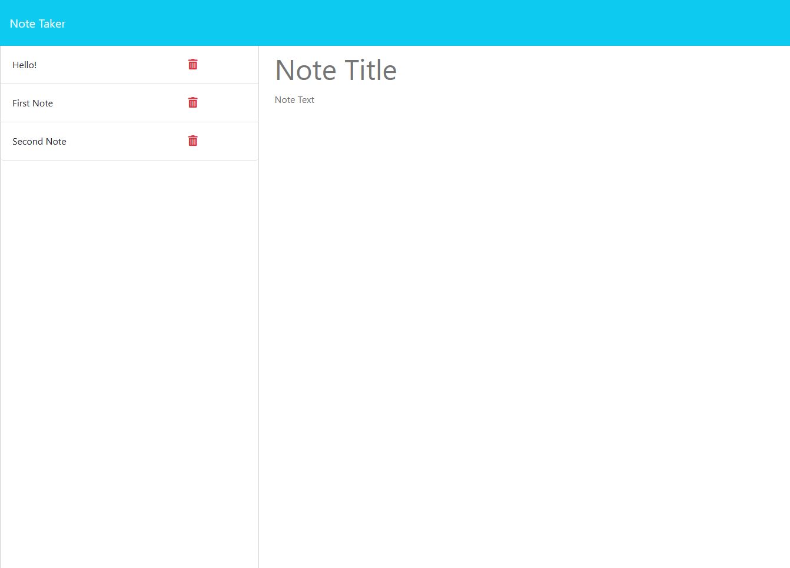

# Note Taker Application

## Description

The Note Taker Application is designed to assist small business owners in organizing their thoughts and managing tasks efficiently. This intuitive application provides a streamlined interface for creating, viewing, and managing notes.

## Features

- **Landing Page**: A welcoming landing page with a navigation link to the notes section.
- **Notes Page**: Displays a list of existing notes on the left-hand side and provides input fields for new note creation on the right-hand side.
- **Create Note**: Allows users to enter a title and content for new notes.
- **Save and Clear**: Options to save the new note or clear the input fields for a fresh start.
- **View Note**: Clicking on an existing note displays its content in the input fields.
- **New Note**: A button to clear the current view and prepare the input fields for a new note entry.

## Installation

1. **Clone the Repository**
   ```bash
   git clone https://github.com/your-username/note-taker.git
   cd note-taker
   ```

2. **Install Dependencies**
   ```bash
   npm install
   ```

3. **Start the Application**
   ```bash
   npm start
   ```


## Contributing

We welcome contributions to enhance the Note Taker Application. Please submit a Pull Request for any improvements or feature additions.

## Screenshots



## Links

GitHub repo: https://github.com/RinjeeG/Note-Taker.git

Render: https://note-taker-1oow.onrender.com